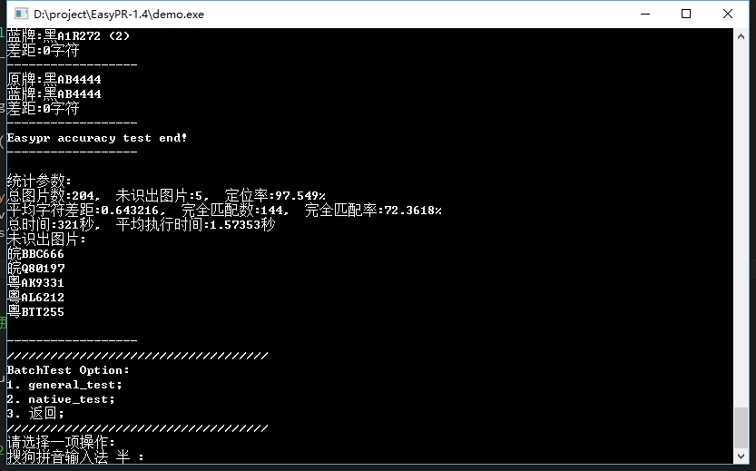

# EasyPR-python
EasyPR-python
## Requirements
* python 3.5
* opencv 3.1
* tensorflow 1.0

## Compare
### easypr-1.4

### easy-python

## TODO
- [x] plate locate
- [x] plate judge

...
Many things to do
## Done
- [x] plate segment

